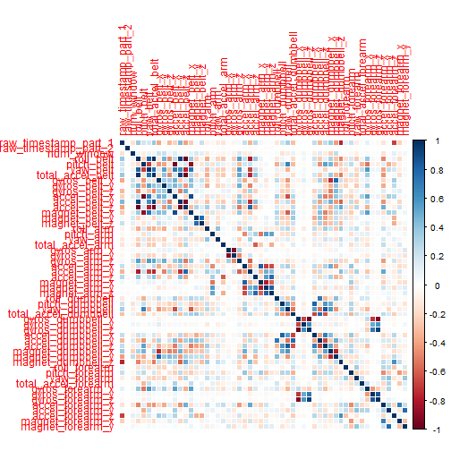
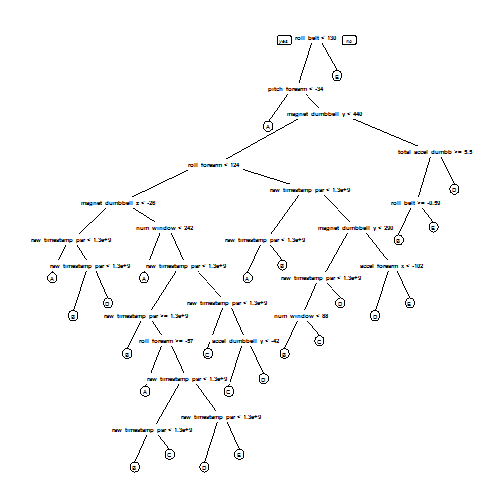

#Background
Using devices such as Jawbone Up, Nike FuelBand, and Fitbit it is now possible to collect a large amount of data about personal activity relatively inexpensively. These type of devices are part of the quantified self movement - a group of enthusiasts who take measurements about themselves regularly to improve their health, to find patterns in their behavior, or because they are tech geeks. One thing that people regularly do is quantify how much of a particular activity they do, but they rarely quantify how well they do it. In this project, your goal will be to use data from accelerometers on the belt, forearm, arm, and dumbell of 6 participants. They were asked to perform barbell lifts correctly and incorrectly in 5 different ways. More information is available from the website here: <http://groupware.les.inf.puc-rio.br/har> (see the section on the Weight Lifting Exercise Dataset).

#Data
The training data for this project are available here:
<https://d396qusza40orc.cloudfront.net/predmachlearn/pml-training.csv>

The test data are available here:
<https://d396qusza40orc.cloudfront.net/predmachlearn/pml-testing.csv>

The data for this project come from this source: <http://groupware.les.inf.puc-rio.br/har>.

#Project Goal
The goal of this project is to predict the manner in which they did the exercise. This is the "classe" variable in the training set. Describing how the model is built, how to cross validates it, evaluate the expected out of sample error, and explain the rationales of any choice made. The prediction model will be used to predict 20 different test cases.

The 5 possible -Classe- values or methods are:

A: exactly according to the specification
B: throwing the elbows to the front
C: lifting the dumbbell only halfway
D: lowering the dumbbell only halfway
E: throwing the hips to the front

#Data downloading, Preprocessing, Reading 
Usuful libraries will be loaded, a downloading & reading script will load the data to crunch.


```r
# Usuful libraries
library(caret)
```

```
## Loading required package: lattice
## Loading required package: ggplot2
```

```r
library(randomForest)
```

```
## randomForest 4.6-10
## Type rfNews() to see new features/changes/bug fixes.
```

```r
library(corrplot)

library(rpart)
library(rpart.plot)

library(e1071)
library(randomForest)
library(corrplot)

#Download the Data
trainUrl <-"https://d396qusza40orc.cloudfront.net/predmachlearn/pml-training.csv"
testUrl <- "https://d396qusza40orc.cloudfront.net/predmachlearn/pml-testing.csv"
trainFile_dest <- "C:\\Users\\Andrea\\Desktop\\coursera\\Practical Machine learning - Coursera\\data\\pml-training.csv"
testFile_dest  <- "C:\\Users\\Andrea\\Desktop\\coursera\\Practical Machine learning - Coursera\\data\\pml-testing.csv"
if (!file.exists("C:\\Users\\Andrea\\Desktop\\coursera\\Practical Machine learning - Coursera\\data")) {
  dir.create("C:\\Users\\Andrea\\Desktop\\coursera\\Practical Machine learning - Coursera\\data")
}
if (!file.exists(trainFile_dest)) {
  download.file(trainUrl, destfile=trainFile_dest)
}
if (!file.exists(testFile_dest)) {
  download.file(testUrl, destfile=testFile_dest)
}

#Reading the data
trainRaw <- read.csv("C:\\Users\\Andrea\\Desktop\\coursera\\Practical Machine learning - Coursera\\data\\pml-training.csv")
testRaw <- read.csv("C:\\Users\\Andrea\\Desktop\\coursera\\Practical Machine learning - Coursera\\data\\pml-testing.csv")

#Data exploration and NA transoframtion (cause input files have been read ) without option such as na.strings=c("", "NA", "#DIV/0!")
dim(trainRaw)
dim(testRaw)

trainRaw[trainRaw == "#DIV/0!"] <- NA # note that this string already is considered a NA
trainRaw[trainRaw == ""] <- NA

summary(trainRaw)
summary(testRaw)
```

The training data set (trainRaw) contains 19622 observations and 160 variables. The testing data set (testRaw) contains 20 observations and 160 variables. 
The aim is to predict the outcome of the "classe" variable in the training set, validate it, and test it on the testRaw


#Data cleaning
Clean off the variable that countains most NAs.
Remove 'X', 'Name' and 'timestamps' variables (they are the culumns 1-5)


```r
trainRaw <- trainRaw[, colSums(is.na(trainRaw)) == 0] 
testRaw <- testRaw[, colSums(is.na(testRaw)) == 0] 

trainRaw <- trainRaw[,-c(1,5)]
testRaw     <- testRaw[,-c(1,5)]
```


#Creating a cross validation set from the trainigRaw data set.

The training set is divided in two parts, one for training and the other for cross validation

The data is split to 3/4 in trainData and testData


```r
set.seed(1001001)

inTrain <- createDataPartition(trainRaw$classe, p=3/4, list=FALSE)
trainData <- trainRaw[inTrain, ]
testData <- trainRaw[-inTrain, ]
```

#Creating the model using Random forest algorithm (trainControl is the function to perform this task, or training).

Fitting Random Forest. RF is the train model selected due to its higly accuracy rate, rubustness in selecting correlated covariates and outliers. Cross validation is used as train control method with 5-fold as parameter number. (could have used  the tuneRF function to find the "optimal" value for "mtry")


```r
controlRf <- trainControl(method="cv", 5)
modelRf <- train(classe ~ ., data=trainData, method="rf", trControl=controlRf, ntree=250)
modelRf
```

```
## Random Forest 
## 
## 14718 samples
##    57 predictor
##     5 classes: 'A', 'B', 'C', 'D', 'E' 
## 
## No pre-processing
## Resampling: Cross-Validated (5 fold) 
## 
## Summary of sample sizes: 11773, 11776, 11774, 11775, 11774 
## 
## Resampling results across tuning parameters:
## 
##   mtry  Accuracy   Kappa      Accuracy SD   Kappa SD    
##    2    0.9949722  0.9936397  0.0018514402  0.0023428364
##   31    0.9985731  0.9981951  0.0007368268  0.0009320795
##   61    0.9974859  0.9968199  0.0017258914  0.0021831591
## 
## Accuracy was used to select the optimal model using  the largest value.
## The final value used for the model was mtry = 31.
```

#Performance evaluation of the Random forest algorithm.

The next step is to estimate the performance of the model on the validation data set here called (testData). A confusionMatrix function and both the estimated accuracy and the the estimated out-of-sample error of the model are calculated.


```r
predictRf <- predict(modelRf, testData)
confusionMatrix(testData$classe, predictRf)
```

```
## Confusion Matrix and Statistics
## 
##           Reference
## Prediction    A    B    C    D    E
##          A 1395    0    0    0    0
##          B    1  948    0    0    0
##          C    0    1  854    0    0
##          D    0    0    1  803    0
##          E    0    0    0    0  901
## 
## Overall Statistics
##                                           
##                Accuracy : 0.9994          
##                  95% CI : (0.9982, 0.9999)
##     No Information Rate : 0.2847          
##     P-Value [Acc > NIR] : < 2.2e-16       
##                                           
##                   Kappa : 0.9992          
##  Mcnemar's Test P-Value : NA              
## 
## Statistics by Class:
## 
##                      Class: A Class: B Class: C Class: D Class: E
## Sensitivity            0.9993   0.9989   0.9988   1.0000   1.0000
## Specificity            1.0000   0.9997   0.9998   0.9998   1.0000
## Pos Pred Value         1.0000   0.9989   0.9988   0.9988   1.0000
## Neg Pred Value         0.9997   0.9997   0.9998   1.0000   1.0000
## Prevalence             0.2847   0.1935   0.1743   0.1637   0.1837
## Detection Rate         0.2845   0.1933   0.1741   0.1637   0.1837
## Detection Prevalence   0.2845   0.1935   0.1743   0.1639   0.1837
## Balanced Accuracy      0.9996   0.9993   0.9993   0.9999   1.0000
```

```r
accuracy <- postResample(predictRf, testData$classe)
accuracy
```

```
##  Accuracy     Kappa 
## 0.9993883 0.9992262
```

```r
oose <- 1 - as.numeric(confusionMatrix(testData$classe, predictRf)$overall[1])
oose
```

```
## [1] 0.0006117455
```

Amazingly the model reached an accuracy of 0.9995922, almost 99.9% ... boom!

#Prediction for the Test Data Set (testRaw).
Prediction using the model modelRF just built using the raw initial data testRaw


```r
final_result <- predict(modelRf, testRaw)

final_result
```

```
##  [1] B A B A A E D B A A B C B A E E A B B B
## Levels: A B C D E
```

#Appendix: some figures to show the outcomes obtained

1) Visual Correlation Matrix of trainData, which is the 3/4 data from the split of trainRaw - the function used is coorPlot from the coorPlot package (the last variable classe is left off)
(note that trainRaw must be numeric so trainDataNum is created by doing trainDataNum <- trainRaw[, sapply(trainRaw, is.numeric)])


```r
trainDataNum <- trainRaw[, sapply(trainRaw, is.numeric)]

corrPlot <- cor(trainDataNum[, -length(names(trainDataNum))])
corrplot(corrPlot, method="color")
```

 

2) Decision Tree Visualization of trainData using rpart


```r
tree_tree <- rpart(classe ~ ., data=trainData, method="class")
prp(tree_tree) # plotting using library(rpart.plot)
```

 
